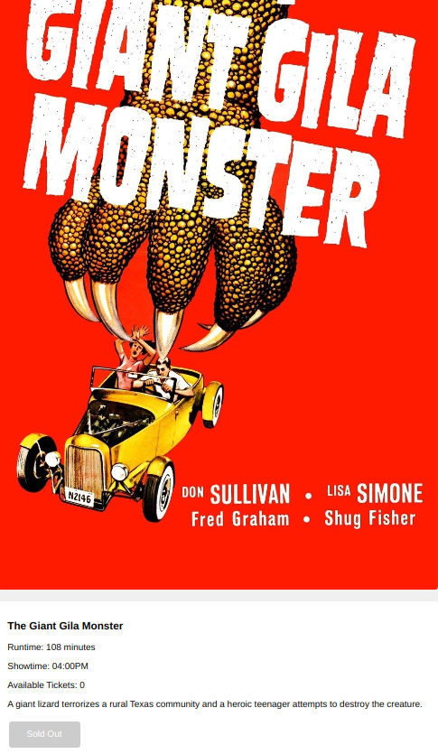
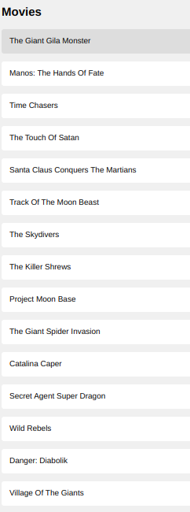
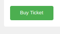
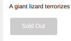

### FLATDANGO 
Flatdango is a simple web application that allows users to purchase movie tickets for the Flatiron Movie Theater. This README file provides an overview of the project and instructions on how to set up and run the application.
## Table of contents
- [Features](#features)
- [Installation](#Installation)
- [Usage](#Usage)
- [Technologies Used](#TechnologiesUsed)
- [Contributing](#Contributing)
- [Link](#Link)
- [Author](#Author)
## Features
- View the first movie's details, including its poster, title, runtime, showtime, and available tickets.
- Browse a menu of all movies on the left side of the page.
- Purchase a ticket for a movie and see the number of available tickets decreasing on the frontend.
- Click on a movie in the menu to replace the currently displayed movie's details with the new movie's details.
- When a movie is sold out, indicate that the movie is sold out by changing the button text to `Sold Out` and adding a class of sold-out to the film item in the `ul#films` menu.
## Installation
1. Install and set up the `json-server` package;
    - Instal `json-server` globally using `npm install -g json-server`
    - Create a `db.json` file with the initial data(see the provided`db.json`file)
    - Start the **JSON** server by running `json-server --watch db.json` in your terminal.
2. Clone the Flatdango reopsitory from GitHub using`git clone git@github.com:VictorIgati/phase-1-challenge3.git`
3. Change into the project directory`cd flatdango`
4. Install the project dependancies.`npm install`
5. Start the local dev server `npm start`
6. Open your browser and vistit **`https://localhost:3000`** to see the flatdango application
## Usage
1. When you first visit the Flatdango application, the details of the first movie will be displayed, including its poster, title, runtime, showtime, and available tickets.e
 
2. The left side of the page will display a menu of all movies. Click on a movie to replace the currently displayed movie's details with the new movie's details.

3. To purchase a ticket for a movie, click the "Buy Ticket" button. The number of available tickets will decrease on the frontend.

4. If a movie is sold out (no available tickets remaining), the button text will change to "Sold Out," and the film item in the ul#films menu will have a class of sold-out.

### Technologies Used
- HTML
- CSS
- JavaScript (ES6)
- `json-server` (for simulating the Flatiron Movie Theater API)

### Contributing
Contributions are welcome! To contribute to the Flatdango project, follow these steps:

1. Fork the repository.
2. Make your changes and commit them: `git commit -m "Add some feature"`
3. Push to the branch: `git push origin feature/your-feature-name`
4. Submit a pull request describing your changes.

### Link 
This is the link yo the webpage only if you've done the required steps
        https://phase-1-challenge3.vercel.app/

### Author 
This README and code were written by __*VICTOR KIBUCHI IGATI*__
